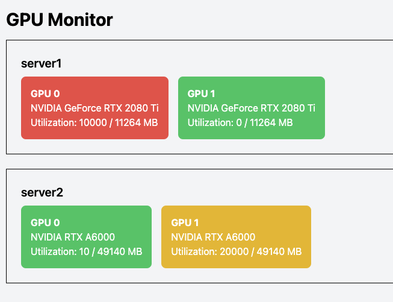

# GPU Monitor

Basic FastHTML wrapper around `nvidia-smi` to monitor GPU utilization.



## Installation
Using [`uv`](https://docs.astral.sh/uv/) is recommended.

Edit `hosts.txt` with one line per server you want to display (see notes). Write "localhost" to refer to the host the server is running on.

Then run:
```bash
uv run uvicorn server:app --host 0.0.0.0 --port 8003
```
In browser, go to `http://<server-ip>:8003`.

### Notes
To make things simple, GPU data for remote servers is currently retrieved via SSH (for this, need to have passwordless SSH setup).

### Development
Run with `GPU_MONITOR_DEV=1` to use local dummy data.